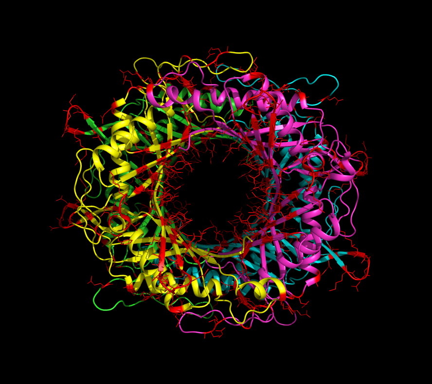

# 1j2g
Glycosylating uricase

  

Uricase is a treatment for gout. It is a tetramer. The potential glycosylation sites are shown in red. As you can see many sidechains are pointing to the inside of the donut hole. This may not be a good thing. I'm also not seeing very many potential glycosylation sites on the alpha helices. This might require some adjustment to the software. The howto may be found in 1j2g.steps, and the predictions may be found in gly.out.
